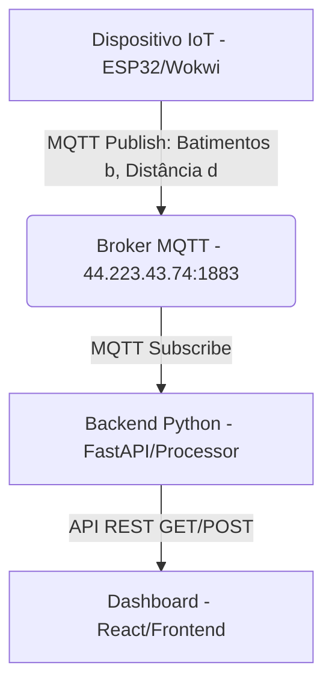

# EloyBand: O Futuro do Trabalho e Bem-Estar com IoT

## 🚀 Visão Geral do Projeto

A **EloyBand** é uma solução inovadora de Internet das Coisas (IoT) desenvolvida para monitorar o bem-estar e a produtividade de colaboradores em ambientes de trabalho remoto ou híbrido. Alinhada ao tema **"O Futuro do Trabalho"** da Global Solution 2025, a EloyBand utiliza um dispositivo vestível (simulado por um ESP32) para rastrear **batimentos cardíacos** e a **proximidade** do usuário em relação ao seu *workspace* (computador).

O objetivo principal é promover um ambiente de trabalho mais saudável e eficiente, combatendo o *burnout* e a baixa produtividade, sem invadir a privacidade do colaborador.

### 👥 Integrantes do Grupo

| Nome | RM |
| :--- | :--- |
| Lucas Toledo | 563271 |
| Leonardo Silva | 564929 |
| Samuel Monteiro | 564391 |

---

## 💡 O Problema e a Solução

### O Desafio: Bem-Estar e Produtividade no Home Office

Com a ascensão do trabalho remoto, surgiram novos desafios: a dificuldade em desconectar do trabalho (*overworking*) e a ineficiência causada pela distração ou falta de foco (*baixa produtividade*). O monitoramento tradicional é invasivo e focado apenas em tarefas, ignorando o bem-estar físico e mental do colaborador.

### A Solução: EloyBand - Monitoramento Inteligente

A EloyBand aborda este problema de forma inteligente, utilizando dados fisiológicos e de contexto (proximidade) para inferir o estado de trabalho do usuário e emitir alertas preventivos.

| Grandeza Monitorada | Sensor (Simulado) |
| :--- | :--- |
| **Batimentos Cardíacos** | Potenciômetro (simulando sensor de pulso) |
| **Proximidade do Workspace** | Sensor Ultrassônico HC-SR04 (simulando distância da band ao PC) |

### Modos de Operação

O sistema de *backend* processa os dados de batimentos e distância para classificar o estado do colaborador em três modos distintos:

| Modo | Condição | Significado |
| :--- | :--- | :--- |
| **WorkOFF** | Batimentos = 0 | O colaborador está fora do expediente ou não está utilizando a band. |
| **WorkON** | Batimentos > 0 E Distância > 50cm | O colaborador está no horário de trabalho, mas está longe do workspace (em pausa, em reunião, ou distraído). |
| **Working** | Batimentos > 0 E Distância ≤ 50cm | O colaborador está ativamente produzindo, próximo ao computador. |

### Alertas Inteligentes

O *backend* rastreia o tempo acumulado em cada modo e gera dois alertas cruciais para o bem-estar e a eficiência:

1.  **Overworking (Alto Risco de Burnout):**
    *   **Condição:** O colaborador permanece no modo **Working** por um longo período de tempo (padrão: mais de 1 hora).
    *   **Ação:** Alerta exibido no Dashboard para incentivar uma pausa.
2.  **Baixa Produtividade:**
    *   **Condição:** O tempo acumulado no modo **WorkON** é significativamente maior do que o tempo no modo **Working** (padrão: razão WorkON/Working > 2.0).
    *   **Ação:** Alerta exibido no Dashboard para que o colaborador reavalie seu foco.

---

## 🛠️ Arquitetura Técnica

O projeto está organizado em um repositório com três branches principais, cada uma contendo o código-fonte de um componente:

| Branch | Componente | Descrição |
| :--- | :--- | :--- |
| `main` | Dashboard (Frontend) | Contém o código React do Dashboard. |
| `iot` | Dispositivo IoT (ESP32) | Contém o código Arduino (`sketch.ino`) para o ESP32. |
| `python` | Backend (API/Processamento) | Contém o código Python (FastAPI/MQTT Processor) do Backend. |

O projeto é dividido em três componentes principais, comunicando-se através do protocolo **MQTT** e uma **API REST**.

O projeto é dividido em três componentes principais, comunicando-se através do protocolo **MQTT** e uma **API REST**.

### 1. Dispositivo IoT (eloyBand) - Branch `iot`

*   **Tecnologia:** ESP32 (simulado no Wokwi).
*   **Comunicação:** MQTT.
*   **Código-Fonte:** `eloyBand/iot/Gs-Edge/sketch.ino`
*   **Tópicos MQTT Publicados:**
    *   `TEF/device023/attrs/b`: Batimentos Cardíacos (valor numérico)
    *   `TEF/device023/attrs/d`: Distância do Workspace em metros (valor numérico)
*   **Link da Simulação Wokwi:** [https://wokwi.com/projects/447627550400062465](https://wokwi.com/projects/447627550400062465)

### 2. Backend (Processamento e API) - Branch `python`

*   **Tecnologia:** Python com FastAPI e Paho-MQTT.
*   **Função:** Receber dados via MQTT, processar a lógica de estados (WorkOFF, WorkON, Working), acumular tempo, gerar alertas e expor os resultados via API REST.
*   **Código-Fonte:**
    *   `eloyBand/backend/Gs-Edge/api.py`: Define os endpoints da API REST.
    *   `eloyBand/backend/Gs-Edge/mqtt_processor.py`: Contém a lógica central de processamento de dados e alertas.

#### Endpoints da API REST (FastAPI)

| Método | Endpoint | Descrição |
| :--- | :--- | :--- |
| `GET` | `/api/band/current` | Retorna o estado atual (modo, batimentos, distância) e alertas ativos. |
| `GET` | `/api/band/statistics` | Retorna o tempo acumulado em cada modo e o histórico de alertas. |
| `GET` | `/api/band/alerts` | Retorna apenas os alertas ativos. |
| `POST` | `/api/band/reset` | Reseta os contadores de tempo e o histórico de alertas. |

### 3. Dashboard (Frontend) - Branch `main`

*   **Tecnologia:** React (com Vite).
*   **Função:** Consumir a API REST do Backend para exibir o estado atual, estatísticas de produtividade e alertas de forma visual e intuitiva.
*   **Código-Fonte:** `eloyBand/dashboard/Gs-Edge/client/src/` (Componentes React e lógica de frontend).

---

## 💻 Como Testar o Projeto (Versão Publicada)

Para testar a funcionalidade completa da EloyBand, você precisará interagir com a simulação IoT e visualizar os resultados no Dashboard publicado.

### 1. Acessar o Dashboard

Abra o Dashboard da EloyBand no seu navegador. É aqui que você verá os dados em tempo real e os alertas.

*   **Dashboard Publicado:** [https://eloydashboard.vercel.app/](https://eloydashboard.vercel.app/)

> **⚠️ Aviso Importante:** O Backend (API Python) está hospedado em um serviço gratuito (Render), que pode entrar em modo de hibernação após um período de inatividade. Se o Dashboard não exibir dados imediatamente, **aguarde cerca de 30 a 60 segundos** para que o Backend acorde e se reconecte ao Broker MQTT.

### 2. Iniciar a Simulação IoT (Wokwi)

A simulação do ESP32 enviará os dados de batimentos e distância para o Backend, que por sua vez, alimenta o Dashboard.

1.  Acesse o link da simulação do ESP32: [https://wokwi.com/projects/447627550400062465](https://wokwi.com/projects/447627550400062465).
2.  Clique no botão **"Start Simulation"** (botão verde) no Wokwi.
3.  A simulação começará a publicar dados de batimentos (Potenciômetro) e distância (Ultrassônico) via MQTT.

### 3. Interagir com os Sensores

No Wokwi, você pode simular os diferentes modos de trabalho:

| Modo a Simular | Ação no Wokwi | Resultado Esperado no Dashboard |
| :--- | :--- | :--- |
| **WorkOFF** | Mova o **Potenciômetro** (Batimentos) para o valor **0**. | O modo deve mudar para **WorkOFF**. |
| **Working** | Mova o **Potenciômetro** para um valor **> 0** E mova o **Ultrassônico** (Distância) para um valor **< 50cm**. | O modo deve mudar para **Working**. |
| **WorkON** | Mova o **Potenciômetro** para um valor **> 0** E mova o **Ultrassônico** (Distância) para um valor **> 50cm**. | O modo deve mudar para **WorkON**. |

**Observação:** O Backend (que processa os dados e gera os alertas) está rodando em um servidor externo e se conecta automaticamente ao broker MQTT, garantindo que o Dashboard receba os dados processados.

---

## 📈 Impacto e Resultados Esperados

A EloyBand não é apenas um projeto técnico, mas uma proposta de valor para o futuro do trabalho:

*   **Para o Colaborador:** Oferece *insights* sobre seus próprios padrões de trabalho, incentivando pausas e ajudando a estabelecer limites saudáveis para evitar o *burnout*. O dashboard atua como uma ferramenta de auto-monitoramento e melhoria pessoal.
*   **Para o Empregador:** Permite uma visão agregada e não invasiva da saúde e produtividade da equipe em *home office*. Ao focar em estados de trabalho e alertas de risco (Overworking), a empresa demonstra preocupação com o bem-estar, aumentando a retenção de talentos e a eficiência a longo prazo.

A solução demonstra a integração eficaz de **IoT (ESP32)**, **Cloud/Backend (FastAPI/MQTT)** e **Visualização de Dados (React)**, materializando o conceito de **monitoramento inteligente** para um futuro do trabalho mais humano e produtivo.
